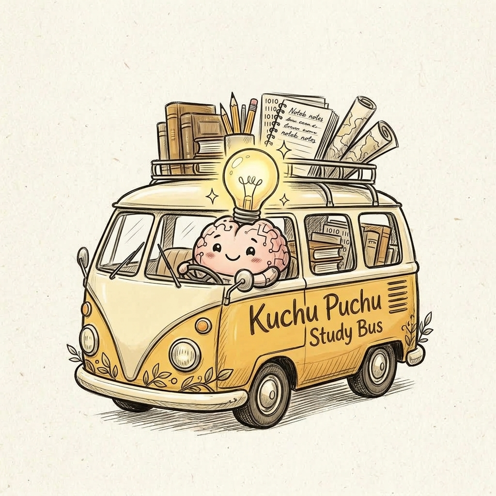
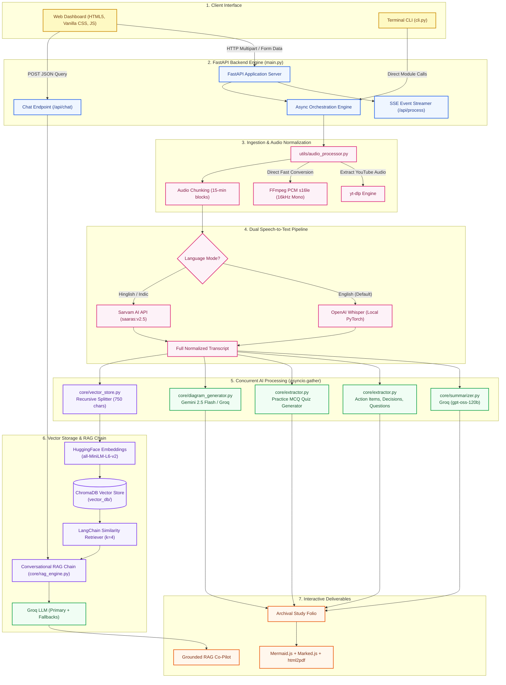
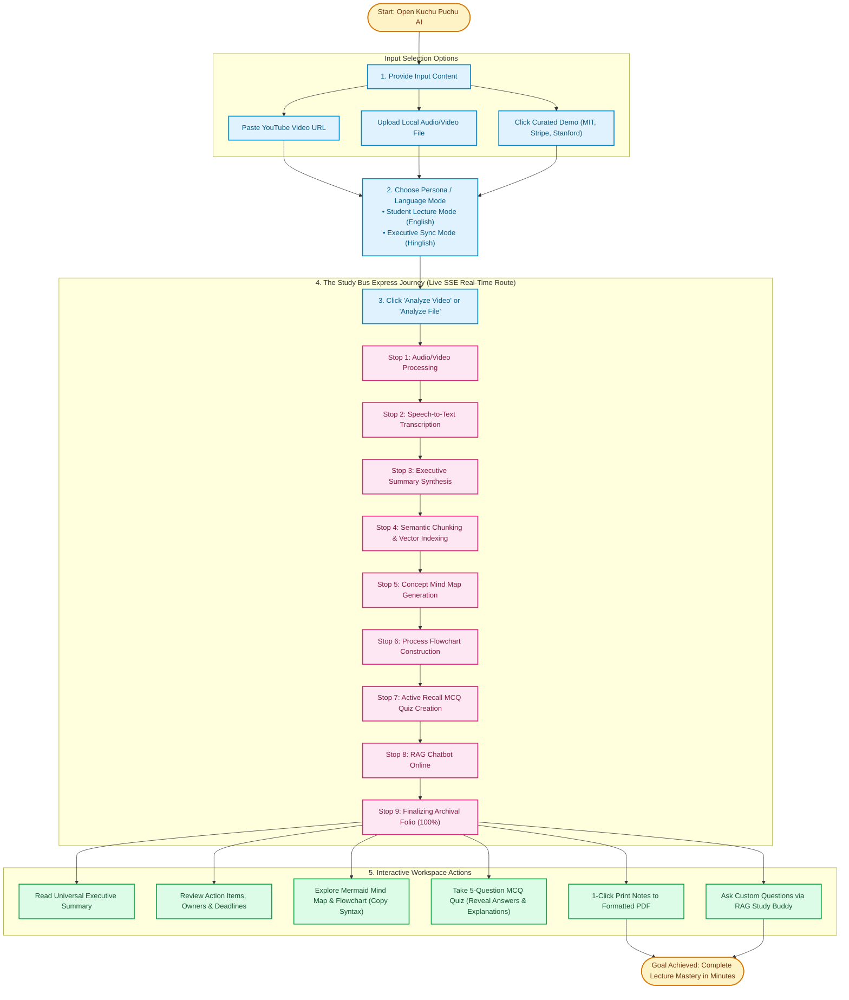

# 🚌 Kuchu Puchu AI — Intelligent Video & Meeting Study Companion

<div align="center">



### *Understand any 2-hour lecture, meeting, or podcast in 3 minutes flat.*

[](https://www.python.org/)
[](https://fastapi.tiangolo.com/)
[](https://www.langchain.com/)
[](https://groq.com/)
[](https://github.com/openai/whisper)
[](https://www.trychroma.com/)
[](LICENSE)

[**Explore Features**](#-key-features) • [**System Architecture**](#-system-architecture) • [**User Journey**](#-user-workflow-journey) • [**Quick Start**](#-quick-start-guide) • [**API & Environment**](#-environment-configuration) • [**CLI Guide**](#-cli-mode)

</div>

---

## 📖 Table of Contents

1. [What is Kuchu Puchu AI?](#-what-is-kuchu-puchu-ai)
2. [Why Kuchu Puchu AI? (The Problem vs. The Solution)](#-why-kuchu-puchu-ai)
3. [✨ Key Features & Deliverables](#-key-features)
4. [🎯 Real-World Use Cases](#-real-world-use-cases)
5. [🏗️ System Architecture](#️-system-architecture)
6. [🗺️ User Workflow Journey](#️-user-workflow-journey)
7. [💻 Tech Stack Deep Dive](#-tech-stack-deep-dive)
8. [🚀 Quick Start Guide](#-quick-start-guide)
   - [Prerequisites](#1-prerequisites)
   - [Installation](#2-clone--install-dependencies)
   - [Environment Configuration](#3-environment-configuration)
   - [Running the Web Application](#4-running-the-web-application)
9. [⌨️ CLI Mode](#-cli-mode)
10. [📂 Project Structure](#-project-structure)
11. [🔐 Security, Privacy & Local Execution](#-security-privacy--local-execution)
12. [🤝 Contributing & License](#-contributing--license)

---

## 🌟 What is Kuchu Puchu AI?

**Kuchu Puchu AI** is an intelligent, multi-modal study companion and meeting intelligence engine designed to turn overwhelming audio and video recordings into interactive, bite-sized **Archival Study Folios**.

Instead of scrubbing through a 2-hour recording or re-listening to lectures at 2x speed, Kuchu Puchu AI ingests any **YouTube link** or **local audio/video file** (`mp4`, `wav`, `mp3`, `m4a`) and produces:

- 📝 **Universal Executive Summary**: Clear, comprehensive, and filler-free conceptual digest.
- ✅ **Action Items, Decisions & Questions**: Ownership matrix with assigned tasks, deadlines, consensus verdicts, and open questions.
- 🧠 **Mermaid Knowledge Mind Maps**: Hierarchical visual taxonomy mapping out core themes and sub-topics.
- 🔀 **Mermaid Process Flowcharts**: Step-by-step procedural workflows showing timelines, decision branches, and causal relationships.
- 🎯 **Active Recall MCQ Quizzes**: Interactive self-testing cards with clickable option reveals, correctness feedback, and explanations.
- 💬 **Grounded RAG Conversational Co-Pilot**: An in-browser chatbot backed by local ChromaDB vector embeddings (`all-MiniLM-L6-v2`) and Groq high-speed LLM inference for zero-hallucination queries.
- 🚌 **The Study Bus Express UI**: A distinctive hand-drawn, paper-notebook user experience complete with real-time SSE progress streaming across a 9-stage animated bus journey.

---

## 💡 Why Kuchu Puchu AI?

| The Traditional Experience 🥱 | The Kuchu Puchu AI Experience 🚀 |
| :--- | :--- |
| **Hours lost scrubbing video timelines** trying to locate a 45-second explanation. | **Instant 3-minute universal digest** capturing key arguments, examples, and conclusions. |
| **Messy, fragmented meeting notes** where nobody remembers who owns which deliverable. | **Automated 3-column triage**: Action Items with deadlines, Key Decisions, and Open Questions. |
| **Passive listening without retention**—forgetting 80% of lecture content by next week. | **Active recall MCQ quiz system** that tests retention right after watching. |
| **Static text summaries** with zero visual spatial structure. | **Dual Mermaid diagrams** (Mind Map + Process Flowchart) renderable and copyable in one click. |
| **Hallucinated chatbot responses** when asking generic AI about your video. | **Grounded RAG pipeline** retrieving verifiable chunks strictly from transcript vector storage. |
| **Boring, sterile enterprise software interfaces**. | **Delightful notebook aesthetic** with washi tape styling, math doodles, and an animated Study Bus! |

---

## ✨ Key Features

### 🎧 1. Multi-Source Ingestion & Optimized Audio Preprocessing
- **Direct YouTube Ingestion**: Powered by `yt-dlp` with automatic stream resolution and audio isolation.
- **Universal Local File Support**: Drag and drop `.mp4`, `.mov`, `.wav`, `.mp3`, `.m4a`, and `.webm`.
- **Fast 16kHz Mono Conversion**: Uses direct FFmpeg C-level subprocess conversion (with PyDub fallback) for sub-second audio prep.
- **Intelligent Chunking**: Slices recordings exceeding 15 minutes into optimal segments for uniform transcription throughput.

### 🎙️ 2. Dual Speech-to-Text Pipeline
- **Local OpenAI Whisper**: Runs directly on your hardware (CPU or CUDA GPU). Uses greedy decoding (`beam_size=1`, `temperature=0.0`, `condition_on_previous_text=False`) to deliver up to **4x faster transcription** without repetitive hallucination loops.
- **Multilingual Indic Support (Sarvam AI)**: Select "Executive Sync Mode (Hinglish)" to route audio through Sarvam AI’s `saaras:v2.5` model. Automatically slices audio into concurrent 25-second pieces to respect API limits and stitches the translated English transcript seamlessly.

### ⚡ 3. Real-Time Streaming & Concurrent Execution
- **Server-Sent Events (SSE)**: The `/api/process?stream=true` endpoint streams live JSON progress events to the browser.
- **Parallel Pipeline**: Once transcription finishes, all 5 post-transcription tasks run concurrently via Python's `asyncio.gather`:
  1. *Executive Summary & Title Generation*
  2. *ChromaDB Vector Indexing & RAG Preparation*
  3. *Mermaid Concept Mind Map Generation*
  4. *Mermaid Process Flowchart Generation*
  5. *MCQ Quiz & Unified Takeaway Extraction*

### 📋 4. Action Items, Key Decisions & Open Questions
- Uses a unified single-roundtrip prompt architecture (`core/extractor.py`) to prevent multiple redundant LLM calls.
- Classifies deliverables with:
  - **Task description**, **Owner**, and **Deadline** (or "Not specified").
  - **Strategic Decisions**: Final consensus and project rulings.
  - **Open Questions**: Unresolved topics and follow-up agendas.

### 📊 5. Dynamic Mermaid Mind Maps & Process Flowcharts
- Generates clean Mermaid.js syntax using **Google Gemini 2.5 Flash** (with automatic fallbacks to **Groq** and **Mistral AI**).
- Dedicated regex sanitization guards (`sanitize_mindmap`, `sanitize_flowchart`) strip invalid identifiers, isolate reserved keywords (`end`, `subgraph`), and ensure 100% renderability in both GitHub and the browser.
- Includes a **1-click "Copy Syntax"** button to paste diagrams directly into Notion, Obsidian, or GitHub Markdown.

### 💡 6. Interactive Active Recall Practice Quiz
- Automatically generates 5 contextual Multiple Choice Questions (MCQs) in raw structured JSON.
- Interactive front-end cards:
  - Select options A, B, C, or D.
  - Instant visual feedback: green badge for correct, red badge for wrong.
  - Automatically highlights the true correct option with clear explanations from the transcript.

### 🤖 7. Conversational RAG Co-Pilot (Meeting Assistant)
- **Local Semantic Vector Store**: Uses HuggingFace `all-MiniLM-L6-v2` embeddings (384-dimensional, normalized) stored in a local ChromaDB collection (`vector_db/`).
- **Grounded Retrieval**: Slices transcript into 750-character semantic chunks with 75-character overlaps.
- **Zero-Hallucination Guard**: Configured with strict prompt boundary conditions—if the answer is not in the recording, the assistant states: *"I could not find this information in the meeting transcript."*

### 📄 8. One-Click Printable Folio & Export
- Formats notes into a print-ready document.
- Built-in PDF export via `html2pdf.js` with custom styling, headers, and footers ready for your binder or digital archives.

---

## 🎯 Real-World Use Cases

```
┌────────────────────────────────────────────────────────────────────────┐
│                      KUCHU PUCHU AI USE CASES                          │
├──────────────────┬──────────────────┬──────────────────┬───────────────┤
│ 🎓 Students &    │ 💼 Engineering & │ 🎙️ Creators &    │ 🔬 Researchers│
│    Self-Learners │    Product Teams │    Podcast Listeners│  & Analysts   │
├──────────────────┼──────────────────┼──────────────────┼───────────────┤
│ • MIT/Stanford   │ • 60-min Sprint  │ • 3-hour Lex     │ • Scientific  │
│   recorded video   Standup / Tech     Fridman / Huberman  conference     │
│   lectures         Architecture sync  podcasts            keynotes       │
│ • SVD, Calculus, │ • Isolates who   │ • Instant topic  │ • Extracts data,│
│   Deep Learning    owns PR reviews    mind maps and      hypotheses, and │
│ • Instant MCQ      & deployments      punchy takeaways    conclusions    │
│   practice tests │ • Flowcharts of  │ • Searchable Q&A │ • Printable PDF │
│   before exams     system designs     with timestamps     notes for team │
└──────────────────┴──────────────────┴──────────────────┴───────────────┘
```

---

## 🏗️ System Architecture

The following diagram illustrates the complete end-to-end data flow from user submission to final RAG-powered retrieval:



---

## 🗺️ User Workflow Journey

From the moment you paste a link to the moment you quiz yourself, here is the complete user journey:



---

## 💻 Tech Stack Deep Dive

```
┌────────────────────────────────────────────────────────────────────────┐
│                        KUCHU PUCHU AI TECH STACK                       │
├──────────────────────────┬─────────────────────────────────────────────┤
│ Core Layer               │ Technologies & Libraries                    │
├──────────────────────────┼─────────────────────────────────────────────┤
│ 🌐 Web Framework & Server│ FastAPI, Uvicorn (ASGI), Jinja2, Multipart │
│ 🎬 Audio / Video Engine  │ yt-dlp, FFmpeg, PyDub, Python standard wave │
│ 🎙️ Speech-to-Text        │ OpenAI Whisper (local PyTorch), Sarvam AI   │
│ 🧠 LLM Orchestration     │ LangChain LCEL, ChatPromptTemplate          │
│ ⚡ LLM Inference Providers│ Groq (gpt-oss-120b), Google Gemini 2.5 Flash│
│                          │ Mistral AI (mistral-small-latest fallback)  │
│ 🗄️ Vector Database & RAG │ ChromaDB, langchain-chroma, tiktoken        │
│ 🧬 Semantic Embeddings   │ HuggingFace (sentence-transformers)         │
│                          │ Model: all-MiniLM-L6-v2 (384-dimensional)   │
│ 🎨 Frontend & Design     │ Semantic HTML5, Vanilla CSS3 (Custom Theme) │
│ 📊 Dynamic Visualization │ Mermaid.js 10.6.1, Marked.js markdown parse │
│ 📑 Document Export       │ html2pdf.js, Browser Print Engine           │
└──────────────────────────┴─────────────────────────────────────────────┘
```

---

## 🚀 Quick Start Guide

### 1. Prerequisites

Before running the project, make sure you have:
- **Python 3.10+** installed: [python.org](https://www.python.org/)
- **FFmpeg** installed and accessible from your system PATH (required for audio extraction & conversion):
  - **Windows**:
    ```powershell
    winget install Gyan.FFmpeg
    ```
    *(or download binaries from [ffmpeg.org](https://ffmpeg.org/download.html) and add `bin/` to system PATH)*
  - **macOS**:
    ```bash
    brew install ffmpeg
    ```
  - **Linux (Ubuntu/Debian)**:
    ```bash
    sudo apt update && sudo apt install ffmpeg
    ```
  - *Verify FFmpeg installation:*
    ```bash
    ffmpeg -version
    ```

---

### 2. Clone & Install Dependencies

```bash
# 1. Clone the repository
git clone https://github.com/azhan-ali/kuchu-puchu-AI.git
cd kuchu-puchu-AI

# 2. Create and activate a virtual environment
# Windows (PowerShell):
python -m venv .venv
.venv\Scripts\activate

# macOS / Linux:
python3 -m venv .venv
source .venv/bin/activate

# 3. Upgrade pip and install dependencies
pip install --upgrade pip
pip install -r requirements.txt
```

---

### 3. Environment Configuration

Create a local `.env` configuration file from the provided template:

```bash
# Windows (PowerShell)
Copy-Item .env.example .env

# Linux / macOS
cp .env.example .env
```

Open `.env` in your text editor and configure your API keys:

```ini
# ==========================================
# Kuchu Puchu AI - Environment Configuration
# ==========================================

# Groq API Key (Primary LLM for fast summary, takeaways, and RAG chat)
# Get your free key at: https://console.groq.com/keys
GROQ_API_KEY=gsk_your_groq_api_key_here

# Google Gemini API Key (Recommended for high-fidelity Mermaid Mind Maps & Flowcharts)
# Get your key at: https://aistudio.google.com/
GEMINI_API_KEY=AIzaSy_your_gemini_api_key_here

# Mistral AI API Key (Optional fallback provider for diagrams and text pipelines)
# Get your key at: https://console.mistral.ai/
MISTRAL_API_KEY=your_mistral_api_key_here

# Sarvam AI API Key (Optional: for Hinglish / Indian language speech translation)
# Get your key at: https://www.sarvam.ai/
SARVAM_API_KEY=your_sarvam_api_key_here
SARVAM_STT_MODEL=saaras:v2.5

# HuggingFace Token (Optional: prevents download rate-limiting for embeddings)
# Get your token at: https://huggingface.co/settings/tokens
HUGGINGFACE_API_KEY=hf_your_huggingface_token_here

# Local Whisper Speech-to-Text Model size
# Options: tiny, base, small, medium, large-v3 (Default: small)
WHISPER_MODEL=small
```

#### Key Requirements Summary:
- **Required**: `GROQ_API_KEY` (runs summarization, takeaways, and RAG chat).
- **Recommended**: `GEMINI_API_KEY` (ensures optimal syntax generation for Mermaid mind maps and flowcharts).
- **Optional**: `SARVAM_API_KEY` (needed only if using Hinglish / Indian speech translation mode).

---

### 4. Running the Web Application

Start the local development server:

```bash
python main.py
```

Or using Uvicorn directly with hot reloading:

```bash
uvicorn main:app --host 0.0.0.0 --port 8000 --reload
```

Once started, open your web browser and navigate to:
```
http://localhost:8000
```

---

## ⌨️ CLI Mode

Prefer working from the terminal? Kuchu Puchu AI includes a full-featured Command-Line Interface (`cli.py`) that runs the identical pipeline and lets you chat with your video directly in the terminal:

```bash
python cli.py
```

### Interactive CLI Walkthrough:
```
Enter YouTube URL or local file path: https://www.youtube.com/watch?v=ZK3O402wf1c
Language (english/hinglish): english
Starting AI Video Assistant...
Extracting audio...
Transcribing audio chunks using Whisper (small)...
Raw transcription (first 300 characters):
Welcome to lecture 1 on linear algebra...

Generating summaries, mind map, flowchart, quiz, and RAG index concurrently...

============================================================
📌 Title: MIT 18.06: Linear Algebra & Matrix Decomposition
📋 Summary:
...
✅ Action Items:
...
🔑 Key Decisions:
...
❓ Open Questions:
...
📝 MCQ Quiz (JSON):
...
🧠 Mind Map (Mermaid):
...
📊 Flowchart (Mermaid):
============================================================

💬 Chat with your meeting (type 'exit' to quit)

You: What is the relationship between rank and nullity?
🤖 Assistant: According to the lecture transcript, the rank-nullity theorem states...
```

---

## 📂 Project Structure

```
kuchu-puchu-AI/
├── .env.example              # Safe environment variable template
├── .gitignore                # Excludes secrets, virtual environments, audio downloads & Chroma DB
├── LICENSE                   # MIT Open Source License
├── README.md                 # Complete project documentation & guide
├── requirements.txt          # Python project dependencies
├── main.py                   # FastAPI application server, SSE streamer & REST endpoints
├── cli.py                    # Terminal interactive interface with RAG chat loop
│
├── app/                      # Web Presentation Layer
│   ├── static/
│   │   ├── css/
│   │   │   └── style.css     # Organic paper notebook theme, washi tapes, responsive layouts
│   │   ├── img/
│   │   │   ├── kuchu_puchu_bus.jpg       # Study Bus graphic for loading stage
│   │   │   ├── kuchu_puchu_owl_logo.jpg  # Companion mascot logo
│   │   │   ├── logo.jpg                  # Application favicon & header emblem
│   │   │   └── avatar.jpg                # Workspace profile avatar
│   │   └── js/
│   │       └── app.js        # SSE event handling, Mermaid rendering, quiz logic & chat RAG
│   └── templates/
│       └── index.html        # Single-page dashboard with math doodles, cargo bay & workspace
│
├── core/                     # AI Pipeline & Intelligence Modules
│   ├── diagram_generator.py  # Mermaid mind map & flowchart generator with syntax sanitizers
│   ├── extractor.py          # Unified action items, key decisions, open questions & MCQ generator
│   ├── rag_engine.py         # Grounded RAG retrieval chain using Groq + fallback routing
│   ├── summarizer.py         # Single-pass & Map-Reduce hierarchical transcript summarizer
│   ├── transcriber.py        # Local Whisper STT & Sarvam AI Hinglish multi-piece translator
│   └── vector_store.py       # ChromaDB indexer using HuggingFace all-MiniLM-L6-v2 embeddings
│
├── utils/                    # Media Processing Utilities
│   └── audio_processor.py    # yt-dlp downloader, FFmpeg 16kHz mono converter & audio chunker
│
├── downloads/                # Local cache for downloaded YouTube audio (ignored by git)
└── vector_db/                # Local persistent ChromaDB vector store (ignored by git)
```

---

## 🔒 Security, Privacy & Local Execution

- **Zero Secret Exposure**: All API keys and secrets are loaded strictly via `.env` and kept out of version control through `.gitignore`.
- **Local Speech-to-Text**: Whisper runs entirely locally on your device—no third-party cloud audio uploading is required for standard English transcription.
- **Local Vector Storage**: ChromaDB maintains your vector database locally on disk (`vector_db/`), meaning your transcript chunks never leave your machine for embedding indexing.
- **Stateless Media Ingestion**: Downloaded media is stored in a temporary ignored `downloads/` directory and can be purged at any time without affecting persisted vector collections.

---

## 🤝 Contributing

Contributions, feedback, and feature suggestions are warmly welcomed!

1. **Fork the Project** (`https://github.com/azhan-ali/kuchu-puchu-AI/fork`)
2. **Create your Feature Branch** (`git checkout -b feature/AmazingFeature`)
3. **Commit your Changes** (`git commit -m 'Add AmazingFeature'`)
4. **Push to the Branch** (`git push origin feature/AmazingFeature`)
5. **Open a Pull Request**

---

## 📄 License

Distributed under the **MIT License**. See [`LICENSE`](LICENSE) for more details.

---

<div align="center">

Made with ❤️ by [**Azhan Ali**](https://github.com/azhan-ali)

*Kuchu Puchu AI — Study smarter, retain deeper, and save hundreds of hours.*

</div>
